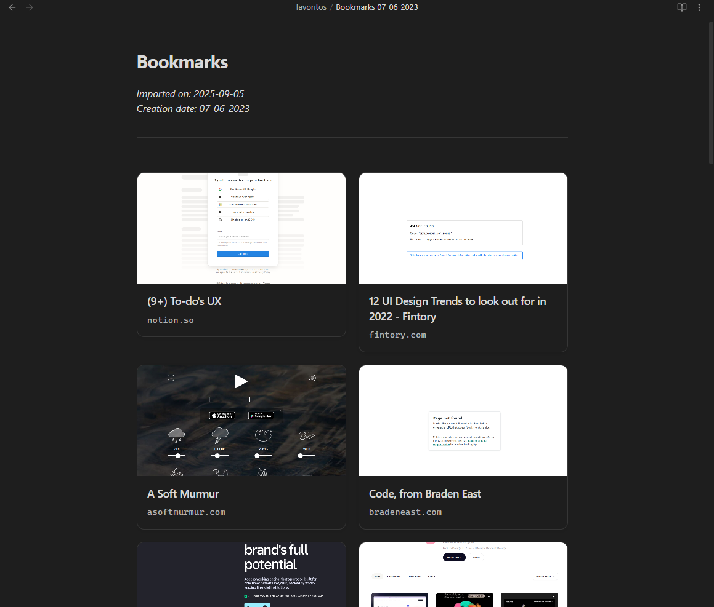

# Bookmarks Importer for Obsidian

Transform your browser bookmarks into beautiful, organized Obsidian notes with HD screenshots and multiple viewing options.



## ✨ Features

### 🎨 **Three Viewing Modes**
- **📱 Cards View** - Visual grid with HD thumbnails and clean typography
- **📊 Table View** - Compact rows with screenshots and links  
- **📝 List View** - Hierarchical folder structure with nested organization

### 🖼️ **HD Screenshots**
- **High-quality thumbnails** at 1920×1080 resolution
- **Smart fallbacks** with placeholder images when screenshots fail

### ⚡ **Advanced File Management**
- **Custom filename patterns** with variables like `{title}`, `{date}`, `{timestamp}`
- **Flexible date formats** (YYYY-MM-DD, DD-MM-YYYY, MM/DD/YYYY, etc.)
- **Output folder selection** to organize your bookmark files
- **Smart date extraction** from HTML metadata

### 🌐 **Universal Compatibility**
- Import from **any browser** (Chrome, Firefox, Safari, Edge)
- Preserves **folder hierarchy** and bookmark organization

## 📖 How to Use

### 1. Export Bookmarks from Your Browser

#### Chrome/Edge
1. Open **Bookmarks Manager** (Ctrl+Shift+O)
2. Click **⋮** → **Export bookmarks**
3. Save the `.html` file

#### Firefox  
1. **Library** → **Bookmarks** → **Show All Bookmarks**
2. **Import and Backup** → **Export Bookmarks to HTML**

#### Safari
1. **File** → **Export Bookmarks**

### 2. Import to Obsidian
1. Click the **bookmark icon** in the ribbon, or use **Ctrl+P** → "Import Bookmarks HTML"
2. Select your exported `.html` file
3. Your bookmarks will be imported with the configured view mode!

## ⚙️ Configuration

Access settings through **Settings** → **Bookmarks Importer**

### File Settings
- **Filename pattern**: `{title} {date}` (customize with variables)
- **Base filename**: Default title for your bookmark files  
- **Date format**: Choose from multiple date formats
- **Output folder**: Specify where to save bookmark files

### Display Settings
- **View mode**: Cards, Table, or List
- Automatic screenshot generation with HD quality

## 🎯 Examples

### Cards View
Perfect for visual browsing with large thumbnails and clean design:
```
[Visual grid of bookmark cards with screenshots and titles]
```

### Table View
Compact layout ideal for quick scanning:
```
| Screenshot | Site |
|------------|------|
| [thumb] | [GitHub - sammarxz/awesome-project](https://github.com/...) |
```

### List View
Preserves your browser's folder organization:
```
# Development
## Frontend
- [React Documentation](https://react.dev)
- [Vue.js Guide](https://vuejs.org)

## Backend  
- [Node.js Docs](https://nodejs.org)
```

## 🔧 Troubleshooting

### Screenshots Not Loading
- **Normal behavior** - Some websites block screenshot services
- **Automatic fallback** - Placeholder images will appear instead
- **HD quality** - Working screenshots will be crisp and clear

### Import Errors
- **Check file format** - Ensure you're importing an HTML bookmark file
- **Browser compatibility** - All major browsers are supported
- **File size** - Large bookmark files may take a moment to process

### File Organization
- **Output folder** - Check your configured output folder setting
- **Filename pattern** - Verify your custom filename pattern is valid
- **Duplicates** - Plugin will prompt before overwriting existing files

## 🤝 Contributing

We welcome contributions! Please check our [issues](https://github.com/sammarxz/obsidian-bookmarks-importer/issues) for ways to help.

### Development Setup
```bash
git clone https://github.com/sammarxz/obsidian-bookmarks-importer
cd obsidian-bookmarks-importer
npm install
npm run dev
```

## 📄 License

MIT License - see [LICENSE](LICENSE) file for details.

## 💖 Support

If you find this plugin helpful:
- ⭐ **Star** the repository
- 🐛 **Report bugs** via GitHub issues  
- 💡 **Suggest features** for future updates
- ☕ **Support development** via [GitHub Sponsors](https://github.com/sponsors/sammarxz)

---

**Made with ❤️ by [Sam Marxz](https://github.com/sammarxz)**

Transform your bookmarks into beautiful, organized knowledge today! 🚀
